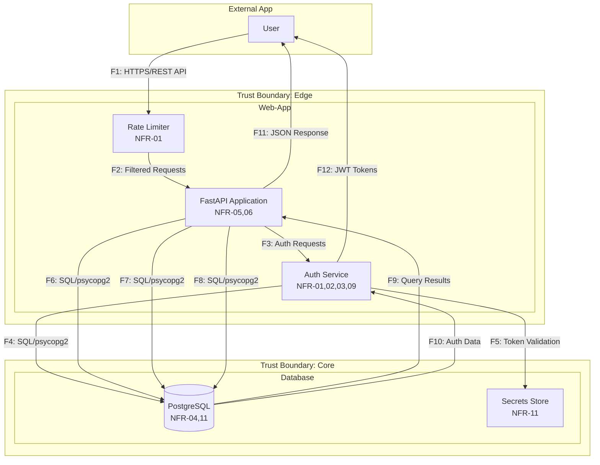

# Data Flow Diagram (DFD)

## Контекстная диаграмма с компонентами безопасности

```mermaid
graph TD
    subgraph External [External App]
        USER[User]
    end

    subgraph TB_Edge [Trust Boundary: Edge]
        subgraph App [Web-App]
            AUTH[Auth Service<br/>NFR-01,02,03,09]
            API[FastAPI Application<br/>NFR-05,06]
            RATE[Rate Limiter<br/>NFR-01]
        end
    end

    subgraph TB_Core [Trust Boundary: Core]
        subgraph Database [Database]
            DB[(PostgreSQL<br/>NFR-04,11)]
            SECRETS[Secrets Store<br/>NFR-11]
        end
    end

    USER -- F1: HTTPS/REST API --> RATE
    RATE -- F2: Filtered Requests --> API
    API -- F3: Auth Requests --> AUTH
    AUTH -- F4: SQL/psycopg2 --> DB
    AUTH -- F5: Token Validation --> SECRETS
    API -- F6: SQL/psycopg2 --> DB
    API -- F7: SQL/psycopg2 --> DB
    API -- F8: SQL/psycopg2 --> DB
    DB -- F9: Query Results --> API
    DB -- F10: Auth Data --> AUTH
    API -- F11: JSON Response --> USER
    AUTH -- F12: JWT Tokens --> USER
```
